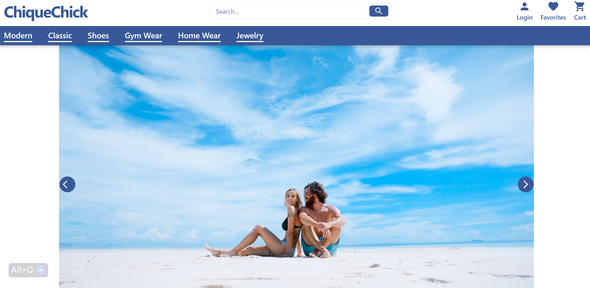

<div align="center" id="top">
  

  &#xa0;

  <!-- <a href="https://reactecommerce.netlify.app">Demo</a> -->
</div>

<h1 align="center">ChiqueChick Store</h1>

<p align="center">
  

  

  

  

  <!--  -->

  <!--  -->

  <!--  -->
</p>

<!-- Status -->

<!-- <h4 align="center">
	🚧  React Ecommerce 🚀 Under construction...  🚧
</h4>

<hr> -->

<p align="center">
  <a href="#dart-about">About</a> &#xa0; | &#xa0;
  <a href="#sparkles-features">Features</a> &#xa0; | &#xa0;
  <a href="#rocket-technologies">Technologies</a> &#xa0; | &#xa0;
  <a href="#white_check_mark-requirements">Requirements</a> &#xa0; | &#xa0;
  <a href="#checkered_flag-starting">Starting</a> &#xa0; | &#xa0;
  <a href="#memo-license">License</a> &#xa0; | &#xa0;
  <a href="https://github.com/jeffjiang13" target="_blank">Author</a>
</p>

<br>

## :dart: About ##

Welcome to the ChiqueChick Store, an exquisite online shopping destination tailored for individuals who appreciate elegance and sophistication in their style. At ChiqueChick Store, we offer a myriad of fashion-forward products that reflect the dynamic and versatile trends of the fashion industry.

The ChiqueChick Store integrates an easy-to-navigate product catalog that features a broad spectrum of products. Detailed descriptions and vivid images are provided for each product to enhance your shopping experience.

At the heart of our e-commerce platform is a responsive Stripe checkout system that guarantees a safe and seamless transaction process. The catalog and product pages are designed to be responsive, ensuring a smooth browsing experience on any device.

Our store also includes a dedicated Contact page, facilitating efficient communication between you and our support team. For any inquiries or feedback, you can reach out to us, and we will ensure that your concerns are addressed promptly.

We also feature a Wishlist page where you can save your favorite items for future purchases. This feature, coupled with our Order History page, adds to the personalized shopping experience that we strive to provide to each customer.

One unique aspect of our store is the "Leave a Review" component. We encourage all our customers to share their experiences and feedback about the products they purchase. Your reviews contribute significantly to the continuous improvement of our products and services.

Finally, our About page offers detailed insights into our store, our journey, and the values that guide us. At ChiqueChick Store, we are not just about selling products - we aim to create a community of style-savvy individuals who value quality, style, and exceptional service.

Join the ChiqueChick community today and redefine your shopping experience!

## :sparkles: Features ##

:heavy_check_mark: Responsive Stripe checkout;\
:heavy_check_mark: Responsive product catalog;\
:heavy_check_mark: Responsive product page;\
:heavy_check_mark: Contact page with email address;\
:heavy_check_mark: billing/shipping page;\
:heavy_check_mark: Wishlist page;\
:heavy_check_mark: Order History page;\
:heavy_check_mark: leave a review component;\
:heavy_check_mark: About page with store information;

## :rocket: Technologies ##

The following tools were used in this project:

- [Postgres](https://www.postgresql.org/)
- [React](https://reactjs.org/)
- [Strapi Headless CMS](https://strapi.io/)
- [Tailwind CSS](https://tailwindcss.com/)


## :white_check_mark: Requirements ##

Before starting :checkered_flag:, you need to have [Git](https://git-scm.com) and [Node](https://nodejs.org/en/) installed.

## :checkered_flag: Starting ##

```bash
# Clone this project
$ git clone https://github.com/jeffjiang13/react-ecommerce

# Access
$ cd react-ecommerce

# Install dependencies
$ yarn

# Run the project
$ yarn start

# The server will initialize in the <http://localhost:3000>
```

## :memo: License ##

This project is under license from MIT. For more details, see the [LICENSE](LICENSE.md) file.


Made with :heart: by <a href="https://github.com/jeffjiang13" target="_blank">Jeff Jiang</a>

&#xa0;

<a href="#top">Back to top</a>
